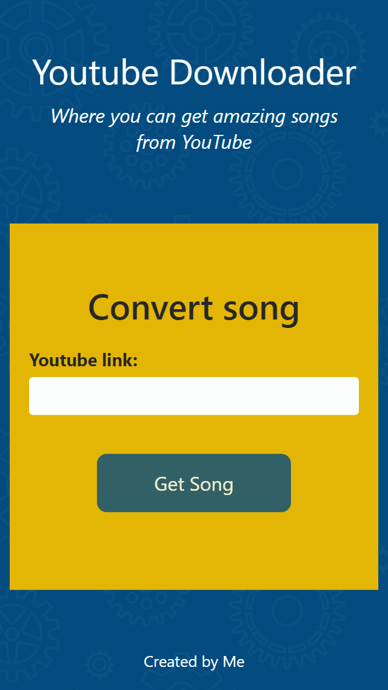
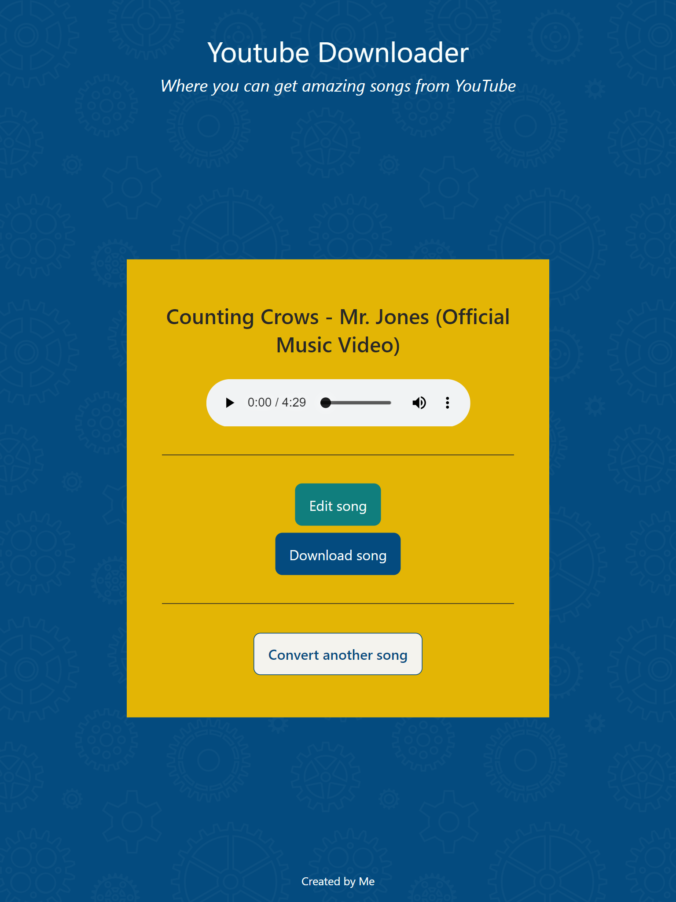
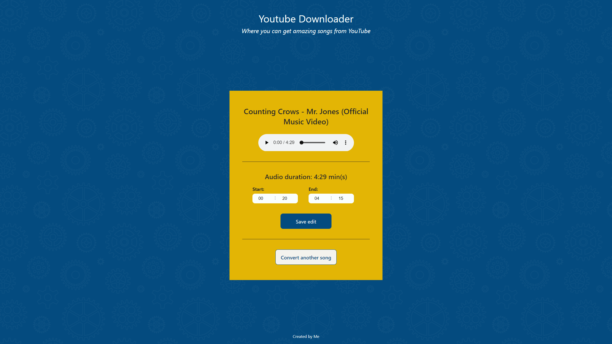

# youtube downloader
> A simple website created with React and TypeScript for the front-end, and Express for the back-end. By using python (together with Node),this allows users to download an mp3 file from youtube.
>
> The app is hosted in railwail: [_Click here to take a look._](https://youtube-downloader.up.railway.app/)

## Table of Contents
* [General Info](#general-information)
* [Technologies Used](#technologies-used)
* [Features](#features)
* [Screenshots](#screenshots)
* [Setup](#setup)
* [Project Status](#project-status)
* [New features](#new-features)
* [Authors](#authors)

## General Information
### Context
I created this project to be able to download music and audio from clips that friends and family have posted in youtube.

### Idea
Download audio from a youtube video in mp3, so I can listen to it locally without being connected to the internet. The server is run in Node.JS and express, but calls a python script using child process to be able to download and transform the audio.

## Technologies Used
### Front-end
- TypeScript
- React
- CSS Modules

### Back-end
- Node.JS
- Express.JS
- Python

### Deployment and hosting
- Docker container
- Railway hosting

## Features
So far, I have incorporated the following features:
- Users can input a youtube url (only full youtube url allowed).
- Users play music on the browser.
- Users download music in mp3.
- Users can edit beginning and ending time of audio before downloading.

## Screenshots

## Setup
The project is separated in three parts: client, server and python. If anybody wants to clone this project, they have to go into the client folder and install dependencies using `npm install`, and then run the development server using `npm start`. To start the server, they have to go into the server folder and install dependencies using `npm install`, and then run the development server using `npm run dev`. A list with all scrips is found in the package.json files included in client and server folders.

For python, they have to go to python folder and then install dependencies with python 3 using `python3 -m pip3 install -r requirements.txt`. ffmpeg and libavcodec-extra are also required, and can be installed in linux with `apt-get install python3 python3-pip ffmpeg libavcodec-extra`.

There is also a Dockerfile in the root folder to create a container. Below are the commands to build and run a docker container:
- Build: `docker build -t youtube-downloader-image .`
- Run: `docker run -p 8080:8080 --name youtube-downloader youtube-downloader-image`

## Project Status
The project is currently on progress, and some additional features will be included in the future.

## New features and bugs
Known bugs:
- The audio gets downloaded as a video in memory, and then converted to audio in memory, before sending it back to the user. This is quite time consuming, especially for longer audio videos.

Future features:
- Waveform display of audio.
- Additional options to edit audio before downloading.
- Sending data with streams to increase speed.

## Authors
This project was created by:
- Alejandro Aburto Salazar - [GitHub](https://github.com/aburto22)